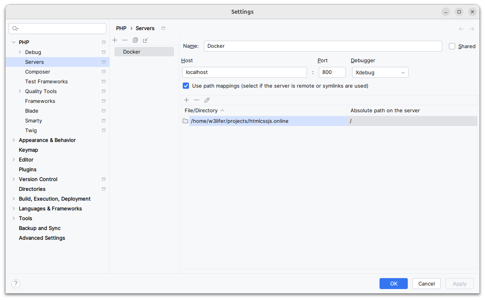

# [laravel-docker](https://github.com/w3roman/laravel-docker)

- MARIADB
- PHP-FPM+CRON
  - UNZIP
  - EXTENSIONS:
    - exif
    - intl
    - pdo_mysql
    - xdebug
    - zip
  - COMPOSER
- NGINX
- NODE
  - NPM
    - sass-embedded
- LARAVEL
  - barryvdh/laravel-ide-helper

---

- [Initialization](#initialization)
- [Access the app](#access-the-app)
- [Start / Restart](#start--restart)
- [xDebug settings](#xdebug-settings)
    - [PhpStorm](#xdebug-settings--phpstorm)

## Initialization

> You can set environment variables in the [[.env](.env)] file

``` sh
git clone https://github.com/w3roman/laravel-docker.git laravel && \
cd laravel && \
make init
```

Once the project is started, the `.git` directory will be deleted and a new repository will be created.

Now you can add your `origin`, make a commit and push it to the remote repository:

``` sh
git remote add origin git@github.com:<user>/<repo>
git add .
git commit -m 'initial commit'
git push -u origin master
```

## Access the app

> Default HTTPS port is 900, see [[.env](.env)] file

1. Add [[localhost-cert.pem](.docker/certs/localhost-cert.pem)] certificate to your Browser.
2. Open https://localhost:900.

For access with domain zone:

- Add the entry `127.0.0.1 localhost.localhost` to your [`hosts`] file.
- Change `APP_URL` to `https://localhost.localhost:${_NGINX_PORT_HTTPS}` in [[app/.env](app/.env)]
- Open https://localhost.localhost:900.

## Start / Restart

``` sh
make start # make s
```

## xDebug settings

<a name="xdebug-settings--phpstorm"></a>
### PhpStorm


