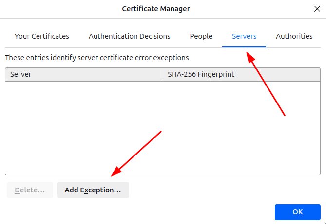

# [docker-laravel](https://github.com/w3roman/docker-laravel)

- MARIADB
- PHP-FPM+CRON
  - UNZIP
  - EXTENSIONS:
    - exif
    - intl
    - pdo_mysql
    - xdebug
    - zip
  - COMPOSER
- NGINX
- NODE
  - NPM
    - sass-embedded
- LARAVEL
  - barryvdh/laravel-debugbar
  - barryvdh/laravel-ide-helper
- HTTPS

> You can set environment variables in the [`.env`](.env) file

---

- [Initialization](#initialization)
- [Development with Firefox](#development-with-firefox)
- [Start / Restart](#start--restart)
- [xDebug settings](#xdebug-settings)
    - [PhpStorm](#xdebug-settings--phpstorm)

## Initialization

**1.** [Install `mkcert`](https://github.com/FiloSottile/mkcert?tab=readme-ov-file#installation) and generate a local CA (Certificate Authority):

```sh
mkcert -install
```

> 

- **Firefox**: `about:preferences#privacy`

> 

- **Chrome/Chromium**: `chrome://certificate-manager/localcerts/platformcerts`

> 

**2.** Clone the project and initialize it:

``` sh
git clone https://github.com/w3roman/docker-laravel.git laravel && \
cd laravel && \
make i # make init
```

Once the project starts, the `.git` directory will be removed, and a new repository will be created.

Now you can add your `origin`, make a commit and push it to the remote repository:

``` sh
git remote add origin git@github.com:<user>/<repo>
git add .
git commit -m 'initial commit'
git push -u origin master
```

**3.** Open https://localhost:900 (default HTTPS port is 900, see [`.env`](.env#L5) file).

For access with a domain zone:
- Change `APP_URL` to `https://localhost.localhost:${_NGINX_PORT_HTTPS}` in [`app/.env`](app/.env#L6).
- Open `https://localhost.localhost:${_NGINX_PORT_HTTPS}`.

## Development with Firefox

During development, when we run `npm run dev`:

``` json
"scripts": {
  "build": "vite build",
  "dev": "vite --host --port=${VITE_PORT}"
}
```

the following errors occur in Firefox:

> Cross-Origin Request Blocked: The Same Origin Policy disallows reading the remote resource at https://[::]:51730/@vite/client...<br>
Cross-Origin Request Blocked: The Same Origin Policy disallows reading the remote resource at https://[::]:51730/resources/js/app.js...

To fix them, you need to add the server `https://[::]:51730` to an exception.

- `about:preferences#privacy`

> 

> 

> 

## Start / Restart

``` sh
make start # make s
```

## xDebug settings

### PhpStorm
<a name="xdebug-settings--phpstorm"></a>

> 
